# CI/CD 架构和流程图

本文档提供可视化的架构图，帮助你理解整个 CI/CD 流程。

## 🏗️ 整体架构图

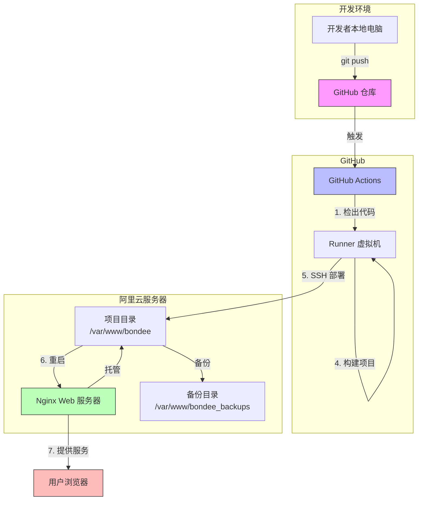

## 🔄 完整部署流程

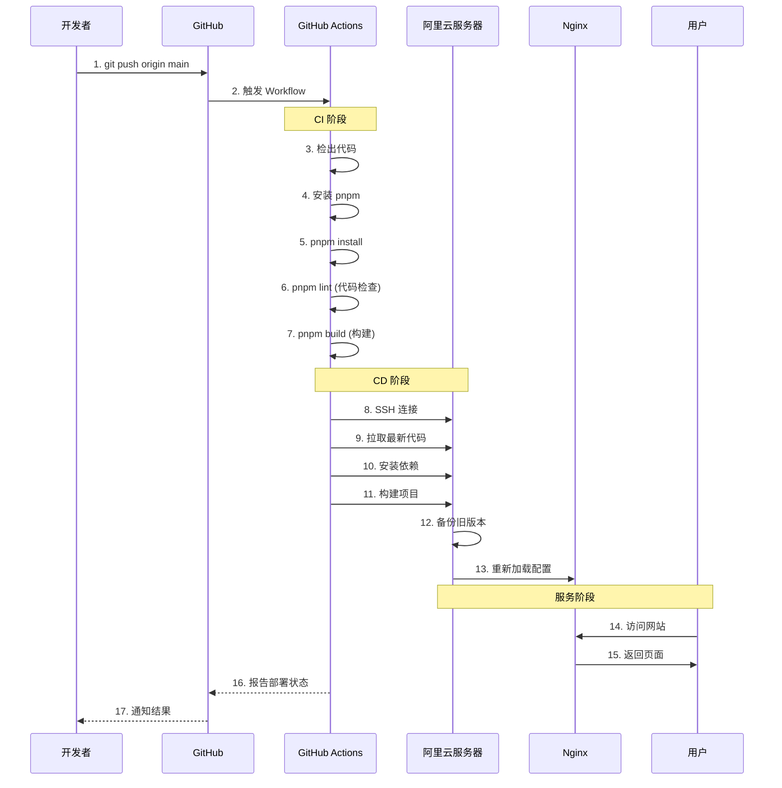

## 📦 文件流转过程

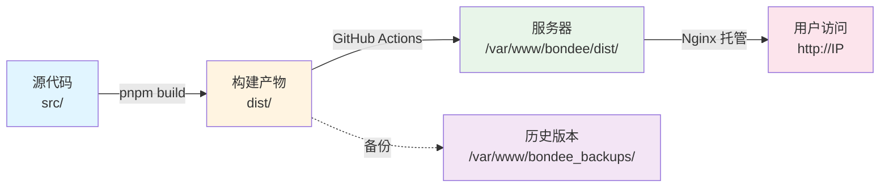

## 🔐 SSH 密钥认证流程

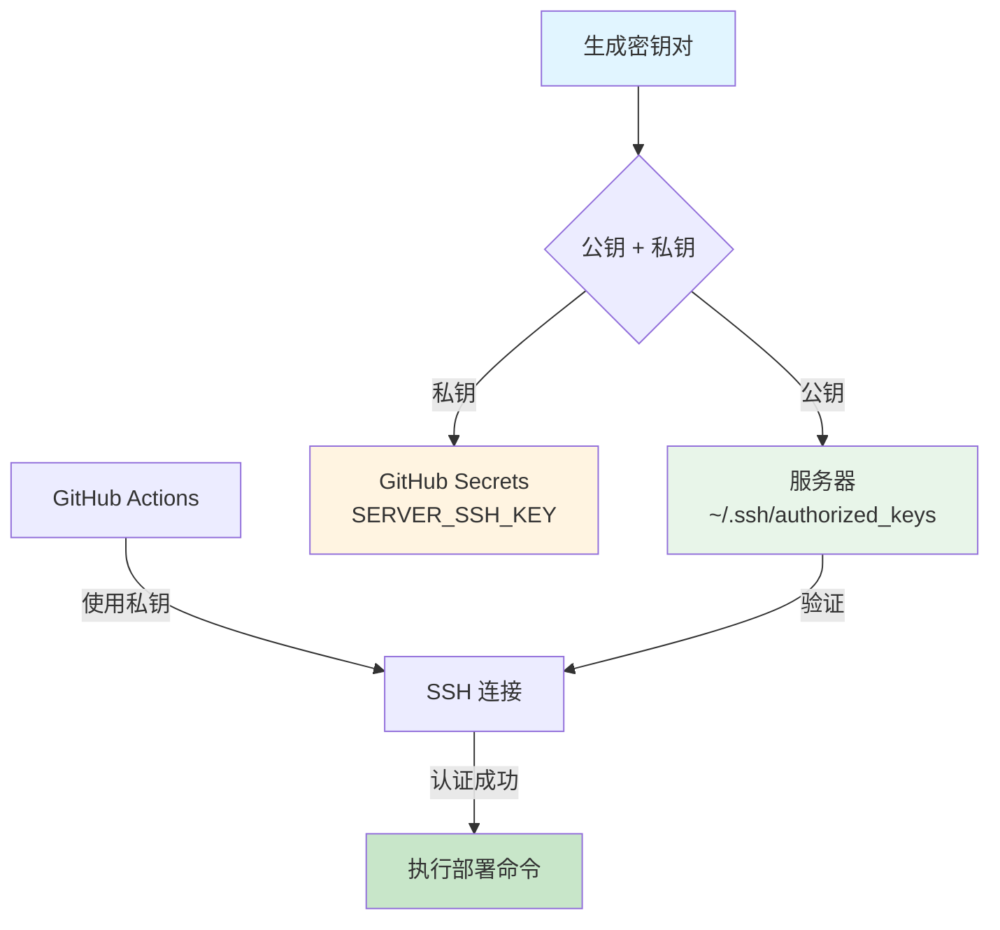

## 🚦 GitHub Actions Workflow 流程

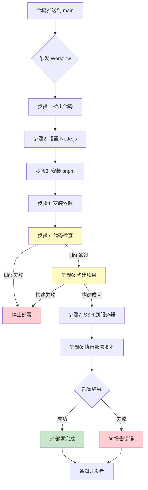

## 🗂️ 服务器目录结构

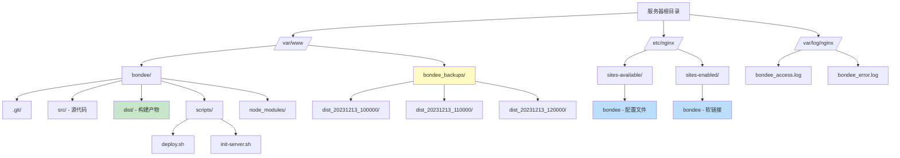

## 🔄 自动备份和回滚机制

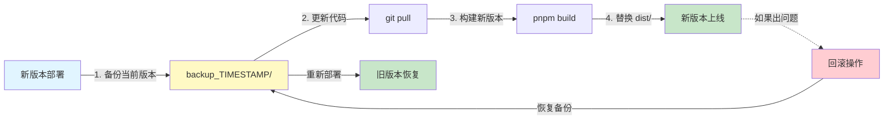

## 🌐 用户访问流程

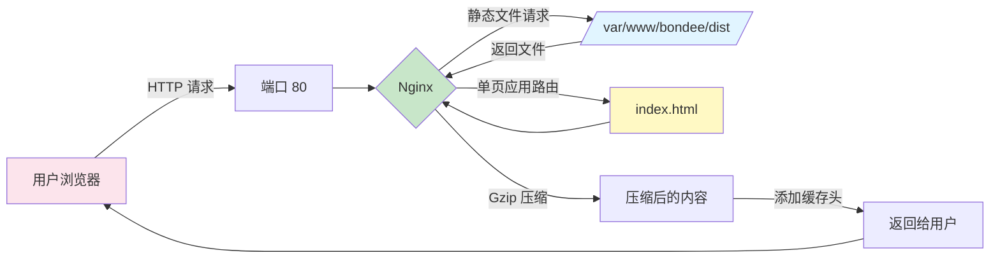

## ⚙️ Nginx 工作原理

```mermaid
graph TD
    A[用户请求<br/>http://IP/about] --> B{Nginx}

    B -->|1. 检查文件| C[/dist/about]
    C -->|不存在| D[/dist/about/]
    D -->|不存在| E[/dist/index.html]

    E -->|找到| F[返回 index.html]
    F --> G[React Router 接管]
    G --> H[渲染 /about 页面]

    B -->|静态资源| I[/dist/assets/main.js]
    I -->|命中| J[检查缓存]
    J -->|1年缓存| K[返回文件]

    style B fill:#c8e6c9
    style E fill:#fff9c4
    style F fill:#c8e6c9
    style K fill:#c8e6c9
```

## 📊 完整的数据流

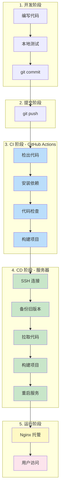

## 🎯 关键概念对照

### CI (持续集成)

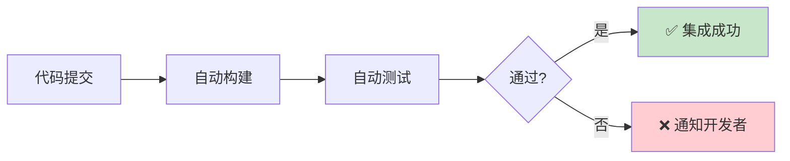

### CD (持续部署)

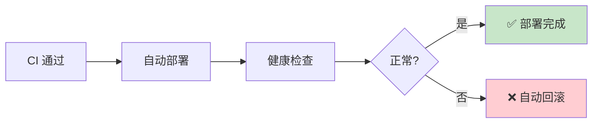

## 📝 总结

通过以上流程图，你可以清晰地看到：

1. **代码如何从本地到服务器**：开发者 → GitHub → Actions → 服务器
2. **每个环节的职责**：开发、集成、部署、托管
3. **自动化的价值**：减少手动操作，提高效率，降低出错率
4. **备份和回滚机制**：确保可以快速恢复到旧版本

---

**相关文档**：

- [CI/CD 完整指南](./CICD_GUIDE.md)
- [快速开始](./CICD_QUICKSTART.md)
- [配置检查清单](./CICD_CHECKLIST.md)
