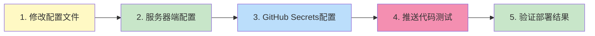

# ✅ CI/CD 文档创建完成

## 📦 已创建的文件

### 📚 文档文件（docs/）

1. **[CICD_INDEX.md](./CICD_INDEX.md)**

   - 文档导航和索引
   - 学习路径推荐
   - 快速查找入口

2. **[CICD_GUIDE.md](./CICD_GUIDE.md)** ⭐ 核心文档

   - CI/CD 完整实施指南
   - 详细解释每个步骤
   - 包含问题排查
   - 约 1000+ 行，非常详细

3. **[CICD_QUICKSTART.md](./CICD_QUICKSTART.md)** 🚀 推荐起点

   - 30 分钟快速上手
   - 三步完成部署
   - 简化的操作流程

4. **[CICD_CHECKLIST.md](./CICD_CHECKLIST.md)** ✓ 验证工具

   - 配置检查清单
   - 逐项验证
   - 故障排查指南

5. **[CICD_ARCHITECTURE.md](./CICD_ARCHITECTURE.md)** 📊 可视化
   - 架构图
   - 流程图（Mermaid）
   - 数据流展示

### 🔧 脚本文件（scripts/）

6. **[scripts/deploy.sh](../scripts/deploy.sh)**

   - 服务器端部署脚本
   - 自动备份、构建、部署
   - 已设置可执行权限

7. **[scripts/init-server.sh](../scripts/init-server.sh)**
   - 服务器初始化脚本
   - 首次部署时使用
   - 已设置可执行权限

### ⚙️ 配置文件

8. **[.github/workflows/deploy.yml](../.github/workflows/deploy.yml)**

   - GitHub Actions 工作流
   - 自动化 CI/CD 流程
   - 详细注释说明

9. **[nginx.conf.example](../nginx.conf.example)**

   - Nginx 配置示例
   - 包含详细注释
   - 支持 SPA 路由

10. **[.gitignore](../.gitignore)** (已更新)

    - 添加部署相关排除规则
    - 防止敏感信息泄露

11. **[README.md](../README.md)** (已更新)
    - 添加 CI/CD 文档链接
    - 更新部署说明

## 🎯 文档特点

### 1. 分层设计

- **快速入门**：适合想快速上手的开发者
- **完整指南**：适合想深入理解的学习者
- **检查清单**：适合排查问题时使用
- **架构图**：适合可视化学习

### 2. 详细注释

每个配置文件都包含：

- ✅ 中文注释
- ✅ 作用说明
- ✅ 参数解释
- ✅ 示例代码

### 3. 教学导向

文档不仅告诉你"怎么做"，还解释：

- 💡 为什么这么做
- 💡 每一步的作用
- 💡 背后的原理
- 💡 常见问题和解决方案

## 📖 推荐阅读顺序

### 方案 A：快速实践（推荐）

```
1. docs/CICD_QUICKSTART.md  (30分钟)
   ↓
2. 实际操作部署
   ↓
3. docs/CICD_CHECKLIST.md  (验证配置)
   ↓
4. docs/CICD_GUIDE.md  (深入理解)
   ↓
5. docs/CICD_ARCHITECTURE.md  (可视化学习)
```

### 方案 B：系统学习

```
1. docs/CICD_GUIDE.md  (完整阅读)
   ↓
2. docs/CICD_ARCHITECTURE.md  (查看流程图)
   ↓
3. docs/CICD_QUICKSTART.md  (动手实践)
   ↓
4. docs/CICD_CHECKLIST.md  (验证配置)
```

## 🚀 下一步操作

### 第一步：修改配置文件（重要！）

在开始部署前，需要修改以下占位符：

#### 1. scripts/init-server.sh

```bash
# 第 9 行
REPO_URL="https://github.com/你的用户名/bondee.git"
# 改为你的实际仓库地址，例如：
REPO_URL="https://github.com/baimin/bondee.git"
```

#### 2. nginx.conf.example

```nginx
# 第 8 行
server_name 你的域名或IP;
# 改为你的实际 IP 或域名，例如：
server_name 123.57.219.76;
```

#### 3. .github/workflows/deploy.yml

确认分支名称是否为 `main`（第 6 行），如果你的主分支是 `master`，需要修改。

### 第二步：准备服务器信息

创建一个临时文档记录以下信息（**不要提交到 Git**）：

```
服务器 IP: _______________
SSH 端口: 22
SSH 用户名: root
SSH 密码: _______________
项目部署路径: /var/www/bondee
GitHub 用户名: _______________
```

### 第三步：开始配置

选择一个指南开始：

**推荐新手**：

```bash
# 在浏览器或编辑器中打开
docs/CICD_QUICKSTART.md
```

**希望深入理解**：

```bash
# 在浏览器或编辑器中打开
docs/CICD_GUIDE.md
```

## 📋 配置步骤概览



### 详细步骤

1. ⚙️ **修改配置文件**（5 分钟）

   - 修改仓库地址
   - 修改服务器 IP

2. 🖥️ **服务器端配置**（15 分钟）

   - 安装 Node.js、Nginx、Git
   - 配置 Nginx
   - 克隆代码

3. 🔐 **GitHub 配置**（5 分钟）

   - 生成 SSH 密钥
   - 配置 Secrets

4. 🚀 **测试部署**（5 分钟）

   - 推送代码
   - 查看 Actions 执行

5. ✅ **验证结果**（5 分钟）
   - 访问网站
   - 检查功能

## 🎓 学习收获

通过完成这套 CI/CD 流程，你将学会：

- ✅ **Linux 服务器管理**

  - SSH 连接和密钥认证
  - 软件包管理（apt）
  - 服务管理（systemctl）
  - 文件权限（chmod, chown）

- ✅ **Nginx Web 服务器**

  - 虚拟主机配置
  - 静态文件托管
  - SPA 路由支持
  - Gzip 压缩和缓存

- ✅ **GitHub Actions**

  - Workflow 编写
  - 触发条件配置
  - Secrets 管理
  - SSH Action 使用

- ✅ **Shell 脚本**

  - Bash 脚本编写
  - 错误处理
  - 自动化流程

- ✅ **CI/CD 理念**
  - 持续集成
  - 持续部署
  - 自动化测试
  - 版本管理

## 💡 重要提示

### ⚠️ 安全注意事项

1. **SSH 私钥绝对不能泄露**

   - 不要提交到 Git
   - 不要分享给他人
   - 定期更换

2. **敏感信息使用 Secrets**

   - IP 地址
   - 密码
   - API 密钥

3. **防火墙配置**
   - 只开放必要端口
   - 阿里云需在控制台配置安全组

### 📝 最佳实践

1. **定期备份**

   - 自动备份已配置
   - 保留最近 5 个版本

2. **查看日志**

   - GitHub Actions 日志
   - Nginx 访问/错误日志

3. **测试后部署**
   - 本地先测试构建
   - 小改动也要测试

## 🔗 相关资源

### 官方文档

- [GitHub Actions](https://docs.github.com/en/actions)
- [Nginx](https://nginx.org/en/docs/)
- [阿里云](https://help.aliyun.com/)

### 进阶学习

- HTTPS 配置（Let's Encrypt）
- CDN 加速（阿里云 OSS）
- Docker 容器化
- 监控告警

## 📞 获取帮助

遇到问题时：

1. **查看文档**

   - [常见问题排查](./CICD_GUIDE.md#常见问题排查)
   - [配置检查清单](./CICD_CHECKLIST.md)

2. **查看日志**

   ```bash
   # GitHub Actions 日志
   仓库 → Actions → 点击运行记录

   # 服务器日志
   sudo tail -f /var/log/nginx/error.log
   ```

3. **手动测试**
   ```bash
   # SSH 到服务器
   cd /var/www/bondee
   bash scripts/deploy.sh
   ```

## ✨ 文档亮点

- 📖 **1500+ 行详细文档**
- 🎨 **10+ Mermaid 流程图**
- 📝 **逐行注释的配置文件**
- ✅ **完整的检查清单**
- 🚀 **两种学习路径**
- 💡 **原理 + 实践结合**

---

**祝你学习愉快！** 🎉

如果觉得文档有帮助，欢迎 Star ⭐

**创建日期**：2025-12-13  
**适用于**：Node.js 20+, React 19, Vite 7, 阿里云服务器
