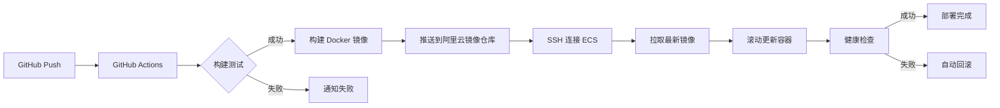

# 阿里云 CI/CD 部署方案

基于你的 Vite + React + TypeScript 项目，为你设计一套完整的阿里云 CI/CD 部署方案。

## 📊 方案概述

### 技术栈

- **应用**: Vite + React 19 + TypeScript + TailwindCSS
- **服务器**: 阿里云 ECS (2 核 2G)
- **CI/CD**: GitHub Actions
- **容器化**: Docker + Docker Compose
- **Web 服务器**: Nginx
- **部署策略**: 蓝绿部署 / 滚动更新

### 架构图



## 📋 User Review Required

> [!IMPORTANT] > **服务器访问方式**
>
> 本方案假设你的阿里云 ECS 已经可以通过 SSH 访问。如果还没有配置，需要：
>
> 1. 在阿里云控制台配置安全组规则，开放必要端口（22, 80, 443）
> 2. 设置 SSH 密钥对用于 CI/CD 自动部署
> 3. 如果需要 HTTPS，需要准备域名和 SSL 证书

> [!WARNING] > **资源限制考虑**
>
> 2 核 2G 服务器资源有限，本方案将：
>
> - 使用 Nginx 作为静态文件服务器（而非 Node.js 服务器）
> - 构建过程在 GitHub Actions 完成，不占用服务器资源
> - 建议生产环境镜像优化，减少内存占用

> [!NOTE] > **可选增强功能**
>
> 基础方案之外，你可以考虑：
>
> 1. **阿里云 OSS + CDN**: 将静态资源托管到 OSS，提升访问速度
> 2. **阿里云容器镜像服务**: 私有镜像仓库（本方案默认使用阿里云 ACR）
> 3. **监控告警**: 接入阿里云云监控或 Prometheus
> 4. **多环境部署**: dev / staging / production 环境隔离

---

## 📦 Proposed Changes

### CI/CD 配置文件

#### [NEW] [deploy.yml](file:///Users/baimin/code/study/react/bondee/.github/workflows/deploy.yml)

创建 GitHub Actions 工作流，实现自动化 CI/CD：

**功能**:

- 触发条件：push 到 main 分支或创建 tag
- 构建步骤：安装依赖 → 类型检查 → Lint → 构建生产版本
- Docker 镜像：多阶段构建，推送到阿里云容器镜像仓库
- 自动部署：SSH 连接服务器，拉取镜像并重启服务
- 通知机制：构建/部署状态通知

---

### Docker 配置

#### [NEW] [Dockerfile](file:///Users/baimin/code/study/react/bondee/Dockerfile)

多阶段 Docker 构建文件：

**特性**:

- **构建阶段**: 使用 Node.js 20 Alpine 镜像，执行 pnpm install 和 build
- **生产阶段**: 使用 Nginx Alpine 镜像，只包含构建产物
- **优化**:
  - 使用 Alpine 减小镜像体积（~20MB vs ~1GB）
  - 多阶段构建避免将开发依赖打包到生产镜像
  - Nginx 配置优化 SPA 路由

#### [NEW] [docker-compose.yml](file:///Users/baimin/code/study/react/bondee/docker-compose.yml)

Docker Compose 编排文件：

**配置**:

- 定义 web 服务
- 端口映射：80:80
- 健康检查配置
- 自动重启策略
- 环境变量管理

#### [NEW] [nginx.conf](file:///Users/baimin/code/study/react/bondee/nginx.conf)

Nginx 配置文件：

**优化**:

- SPA 路由支持（所有路由返回 index.html）
- Gzip 压缩
- 静态资源缓存策略
- 安全头部配置

---

### 服务器端脚本

#### [NEW] [deploy.sh](file:///Users/baimin/code/study/react/bondee/scripts/deploy.sh)

服务器端部署脚本：

**功能**:

- 拉取最新 Docker 镜像
- 优雅停止旧容器
- 启动新容器
- 健康检查
- 清理旧镜像（节省空间）
- 日志记录

#### [NEW] [healthcheck.sh](file:///Users/baimin/code/study/react/bondee/scripts/healthcheck.sh)

健康检查脚本：

**检查项**:

- 服务是否运行
- HTTP 响应是否正常
- 响应时间是否正常

#### [NEW] [rollback.sh](file:///Users/baimin/code/study/react/bondee/scripts/rollback.sh)

回滚脚本：

**功能**:

- 回滚到上一个版本
- 支持指定版本回滚
- 自动健康检查

---

### 文档

#### [NEW] [DEPLOY_GUIDE.md](file:///Users/baimin/code/study/react/bondee/docs/DEPLOY_GUIDE.md)

部署指南文档：

**内容**:

1. **服务器初始化**: ECS 环境配置步骤
2. **GitHub Secrets 配置**: 所需密钥列表和设置方法
3. **首次部署**: 详细的初始部署流程
4. **日常部署**: Git push 后的自动化流程
5. **域名配置**: DNS 和 SSL 证书设置（可选）
6. **故障排查**: 常见问题和解决方案

#### [NEW] [OPERATIONS.md](file:///Users/baimin/code/study/react/bondee/docs/OPERATIONS.md)

运维手册：

**内容**:

- 日常运维命令
- 日志查看
- 性能监控
- 备份恢复
- 扩容方案

---

### 配置文件更新

#### [MODIFY] [.gitignore](file:///Users/baimin/code/study/react/bondee/.gitignore)

添加部署相关文件：

- `.env.production`
- `deploy-*.log`

#### [MODIFY] [package.json](file:///Users/baimin/code/study/react/bondee/package.json)

添加部署相关脚本：

```json
"scripts": {
  "build:prod": "tsc -b && vite build --mode production",
  "docker:build": "docker build -t bondee:latest .",
  "docker:run": "docker-compose up -d"
}
```

---

## 🔍 Verification Plan

### 自动化测试

1. **本地 Docker 构建测试**

   ```bash
   # 在项目根目录执行
   docker build -t bondee:test .
   docker run -p 8080:80 bondee:test
   # 访问 http://localhost:8080 验证是否正常
   ```

2. **GitHub Actions 工作流测试**

   - 创建一个测试分支，推送代码触发 CI
   - 检查 GitHub Actions 页面，确认所有步骤成功执行
   - 验证构建产物和 Docker 镜像

3. **健康检查脚本测试**
   ```bash
   # 在服务器上执行
   cd /opt/bondee
   ./scripts/healthcheck.sh
   ```

### 手动验证

1. **首次部署验证**

   - 用户需要按照 `DEPLOY_GUIDE.md` 完成服务器初始化
   - 配置 GitHub Secrets
   - 执行首次部署
   - 通过公网 IP 或域名访问应用
   - 验证页面正常加载、路由跳转正常

2. **CI/CD 流程验证**

   - 修改代码并推送到 main 分支
   - 等待 GitHub Actions 自动执行
   - 验证服务器上的应用自动更新
   - 检查零停机更新是否生效

3. **回滚功能验证**

   - 在服务器执行回滚脚本
   - 验证应用回滚到上一版本
   - 确认健康检查通过

4. **性能和稳定性验证**
   - 使用浏览器开发者工具检查资源加载时间
   - 验证 Gzip 压缩是否生效
   - 验证静态资源缓存策略
   - 压力测试（可选）

---

## 💡 方案优势

### 开发体验

- ✅ **零配置部署**: Git push 即自动发布
- ✅ **快速反馈**: 3-5 分钟内完成构建和部署
- ✅ **可视化**: GitHub Actions 提供清晰的部署日志
- ✅ **安全**: 敏感信息通过 GitHub Secrets 管理

### 运维效率

- ✅ **Docker 容器化**: 环境一致性，易于迁移
- ✅ **零停机部署**: 滚动更新不影响用户访问
- ✅ **自动回滚**: 部署失败自动回退
- ✅ **健康检查**: 自动监测服务状态

### 成本优化

- ✅ **资源节省**: 构建在 GitHub Actions，不占用服务器资源
- ✅ **镜像优化**: Alpine 基础镜像，节省存储和带宽
- ✅ **自动清理**: 定期清理旧镜像和容器

---

## 🚀 后续扩展建议

### 短期优化（1-2 周）

1. **环境分离**: 添加 dev/staging 环境
2. **监控告警**: 对接钉钉/企业微信推送部署结果
3. **性能优化**: CDN 加速（阿里云 OSS + CDN）

### 中期优化（1-2 月）

1. **自动化测试**: 集成单元测试和 E2E 测试
2. **灰度发布**: 支持分批次发布
3. **日志聚合**: ELK 或阿里云日志服务

### 长期优化（3-6 月）

1. **Kubernetes**: 迁移到 K8s 集群（如业务增长）
2. **微服务**: 前后端分离架构
3. **多区域部署**: 高可用和容灾
