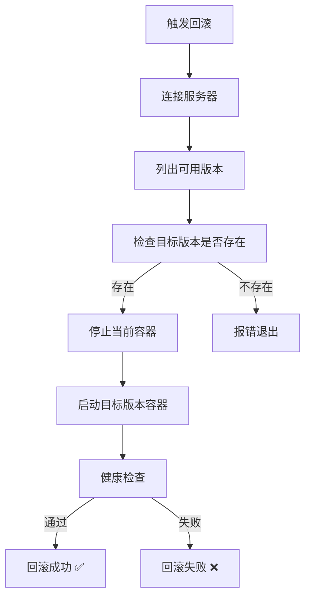

# GitHub Actions 回滚指南

本文档介绍如何通过 GitHub Actions 进行一键回滚操作。

## 🚀 快速回滚步骤

### 方式一：回滚到上一版本（最常用）

1. 打开你的 GitHub 仓库
2. 点击顶部的 **Actions** 标签
3. 在左侧工作流列表中，选择 **"Rollback to Previous Version"**
4. 点击右侧的 **"Run workflow"** 按钮
5. 保持默认设置（version 字段留空或填 `previous`）
6. 点击绿色的 **"Run workflow"** 确认
7. 等待 2-3 分钟，回滚完成

### 方式二：回滚到指定版本

如果你想回滚到更早的版本：

1. 首先，SSH 到服务器查看可用版本：

   ```bash
   ssh root@your_server_ip
   docker images bondee
   ```

2. 记下想要回滚的版本标签（TAG 列）

3. 在 GitHub Actions 中：
   - 点击 **Actions** → **Rollback to Previous Version**
   - 点击 **Run workflow**
   - 在 **version** 字段输入具体的版本标签（如 `20231213-143022`）
   - 点击确认

## 📊 回滚工作流程



## 🎯 可用的版本标签

每次部署会自动创建和保留以下版本标签：

| 标签       | 说明                             | 示例      |
| ---------- | -------------------------------- | --------- |
| `latest`   | 当前运行的最新版本               | -         |
| `previous` | 上一个部署的版本（用于快速回滚） | -         |
| Git SHA    | 每次提交对应的版本               | `abc1234` |

## 🔍 查看回滚日志

1. 在 GitHub Actions 页面，点击对应的回滚工作流运行
2. 展开各个步骤查看详细日志
3. 关键步骤：
   - **Display rollback info**: 显示回滚目标
   - **Execute rollback on server**: 执行回滚的详细过程
   - **Verify rollback**: 验证回滚是否成功

## ⚠️ 注意事项

### 数据库兼容性

如果新版本修改了数据库结构，回滚前需要考虑：

- 数据库 schema 是否向后兼容
- 是否需要同时回滚数据库
- 是否有数据迁移脚本

### 版本保留

- 部署流程会自动保留 `latest` 和 `previous` 两个版本
- 其他版本标签（如 Git SHA）需要手动管理
- 定期清理旧镜像可能导致无法回滚到很久前的版本

### 回滚失败处理

如果回滚失败：

1. 查看 GitHub Actions 日志中的错误信息
2. SSH 登录服务器手动检查：

   ```bash
   cd /opt/bondee
   docker compose ps
   docker compose logs --tail=100
   ```

3. 如有必要，使用服务器端脚本手动回滚：
   ```bash
   ./scripts/rollback.sh
   ```

## 🆚 对比：GitHub Actions vs 服务器手动回滚

| 特性         | GitHub Actions             | 服务器手动           |
| ------------ | -------------------------- | -------------------- |
| **便利性**   | ⭐⭐⭐⭐⭐ 点击即可        | ⭐⭐⭐ 需要 SSH 登录 |
| **可见性**   | ⭐⭐⭐⭐⭐ 完整日志        | ⭐⭐⭐ 终端输出      |
| **权限控制** | ⭐⭐⭐⭐⭐ GitHub 权限管理 | ⭐⭐⭐ 服务器权限    |
| **速度**     | ⭐⭐⭐⭐ 2-3 分钟          | ⭐⭐⭐⭐⭐ 1 分钟    |
| **适用场景** | 日常使用                   | 紧急情况/调试        |

## 💡 最佳实践

1. **先回滚代码，如果不行再回滚数据库**
2. **在回滚前通知团队成员**
3. **记录回滚原因和时间**
4. **回滚后立即修复问题，重新部署**
5. **定期测试回滚流程，确保可用**

## 🔗 相关文档

- [部署指南](./DEPLOY_GUIDE.md)
- [运维手册](./OPERATIONS.md)
- [CI/CD 方案](./CI_CD_PLAN.md)

---

**最后更新**：2025-12-13
